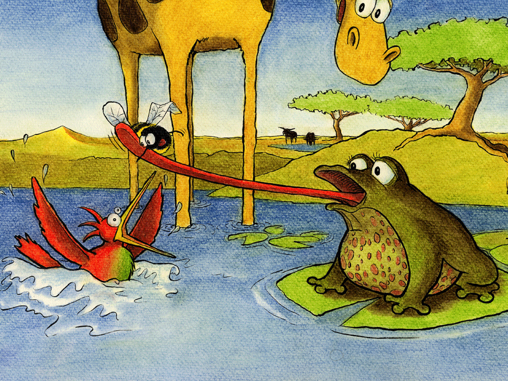

Snart var Samuel sliten i knærne

De stoppet ved vannet for å kjøle ned tærne

De gurglet og badet hver etter tur

Men så ikke padden som lå der på lur

Padden kvekket og blåste sin lunge

Og fanget inn Halvor med slimete tunge

Kolibrien hørte humlen klynke

Og ropte: “Padde, stopp, du vil synke!”

Vær rimelig padde, og ta deg til vett

Sett Halvor tilbake, deg selv på diett!

Det piplet inn vann over liljeflaket

Og Halvor kjempet tappert tilbake

Padden kjente sin mage rumle

Men satte tilbake en vettskremt humle