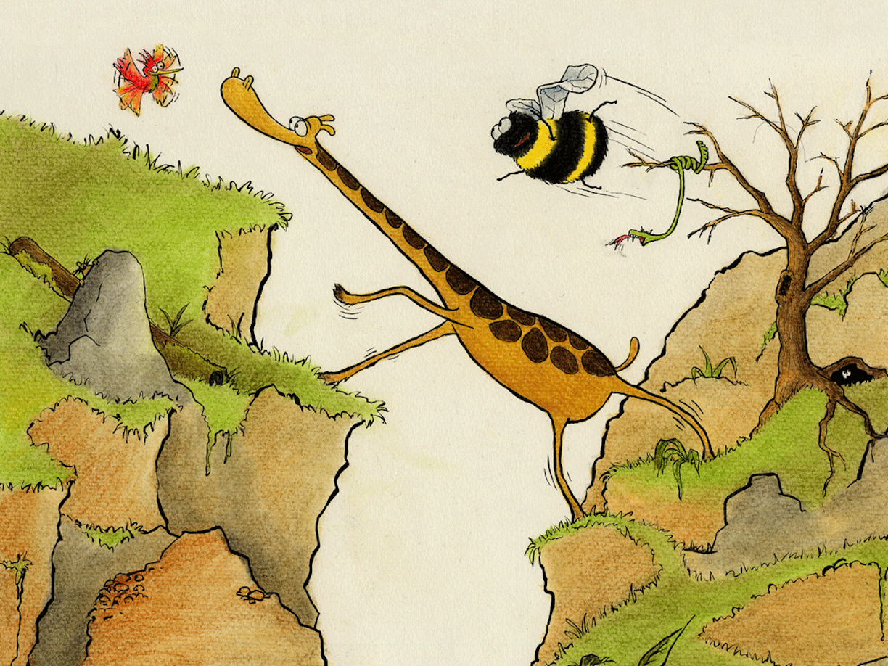

Turen gikk over stokker og sten

Med flaksende vinger og skjelvende ben

Om Samuel snublet og satte fast foten

Var Kris alltid rede og løsnet på roten

Halvor fløy som i hard turbulens

Og voktet seg vel for ikke å få skrens

De strevde og lette på lykke og fromme

Og klatret i fjellet til dagen var omme