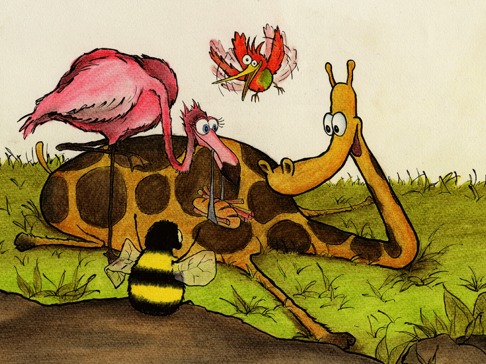

De våknet ved daggry under skyet himmel

Og Samuel kjente seg sulten og svimmel

Men skjønte fort at hjelpen var nær

Da det flakset og bakset i rosa fjær

De hilste velkommen Frederikkes entré

Mens humla rødmet og måtte se ned

Jeg så dere ga bort all fersk proviant

Og fløy over vannet, se her hva jeg fant!

Den vimsete fuglen som stod på én fot

Fikk fylt våre venner på nytt med godt mot

Til Halvor hun sendte et lurt lite smil

Før hun flakset avgårde i hast som en pil