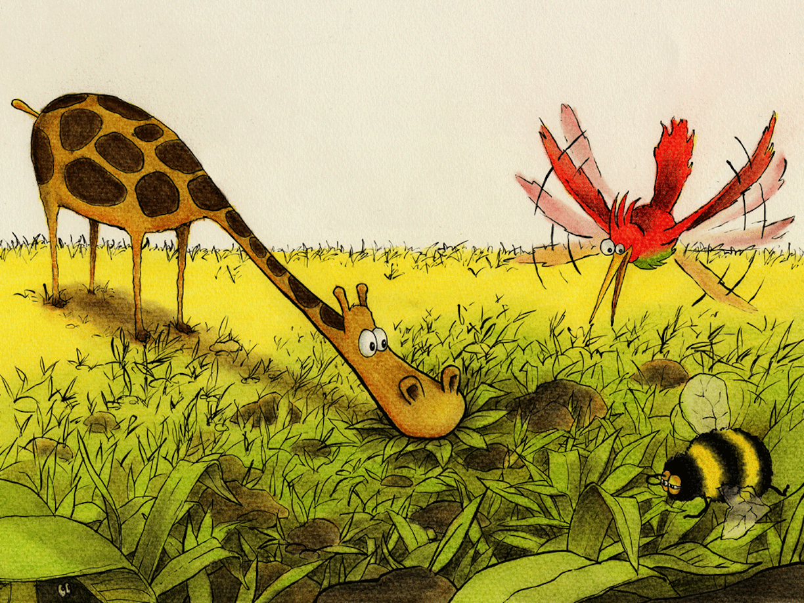

Mild bris fra åsen strøk svalt over kroppen

Den bar med seg lukten av blomsten på toppen

De lette og lette, men klarte ikke se

Hvor kunne det være, det Visdommens Tre?

Halvor satt motløs på Samuels snute

Og følte en liten stund alt håp var ute

Den stakkars humla var i labert humør

Han sukket oppgitt “jeg kjenner det klør”

Mens Halvor hovnet med rødlig eksem

Satte Kris begeistret ting i system!

Symptomene Halvor, jeg tror det vil si

Blomsten er nær, og du har allergi!