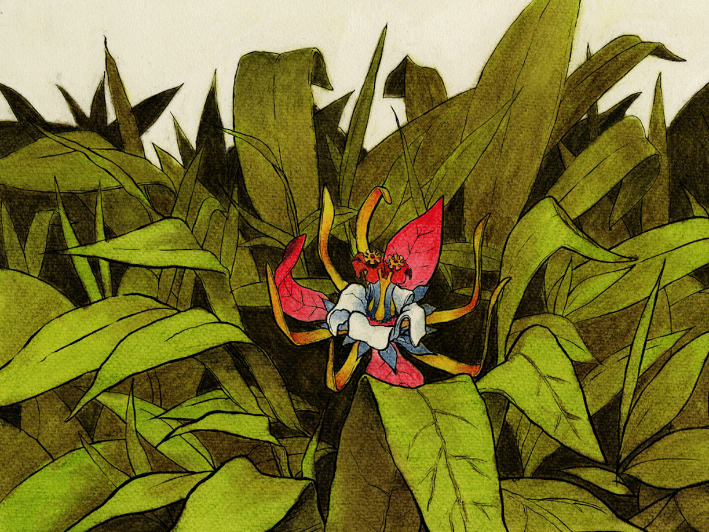

Godt bortgjemt i gresset, der kunne de se

Det glimret i farger fra en vill orkidé!

I regnbuens glans så den ut til å skinne

Men treet på toppen var ikke å finne

Se! Jublet Samuel, så liten og vakker!

Og hør godt etter, jeg tror jammen den snakker!

Jeg vet dere opplevde mye besvær

Og trosset hver fare før dere kom her

Det er ikke slik dere muligens tror

At fjellet er stedet der treet ditt gror

Tenk godt over det som din bestefar sa

Og se deg tilbake der du reiste fra