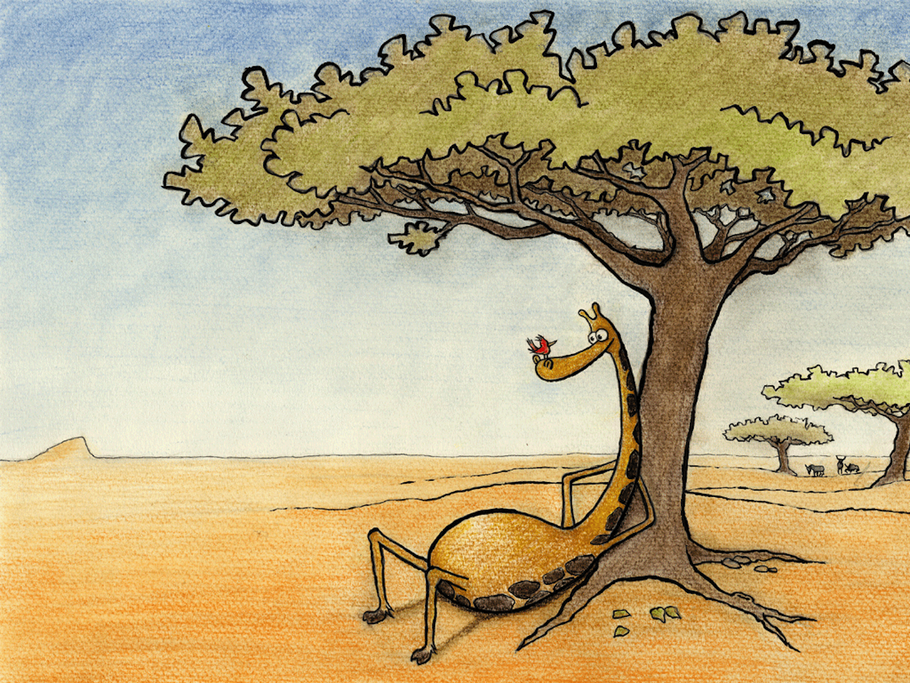

Midt på savannen, i ly av et tre

Satt sjiraffen Samuel og en kolibri i fred

Her tok de seg gjerne en liten rast

Og satt og pratet om løst og fast

De utvekslet tanker i timer i strekk

Og hygget seg sammen så tiden fløy vekk

Men blader på treet ga små hull i skyggen

Så Samuel fikk solbrente  flekker på ryggen

