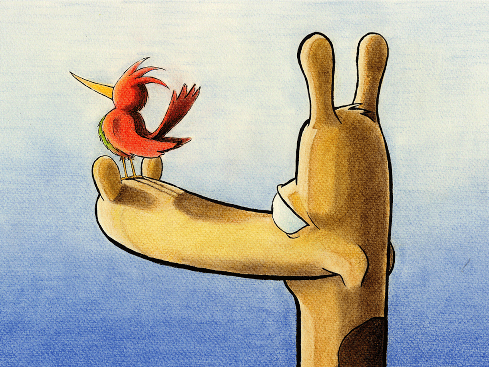

Når kveldssolen sluknet og nattmørket falt

Kom stjerner til syne og skinte på alt

Og jorden og himmelen smeltet til ett

Slik virket savannen så underlig lett

Engang hadde Samuels bestefar sagt

At stjerner som glitret i skimrende prakt

Var gjenskinn av alle de dyr som levde

Men bare de snille, ville Samuel hevde

Sjiraffen lente seg tett inntil stammen

Før begge to sovnet og snorket lavt sammen