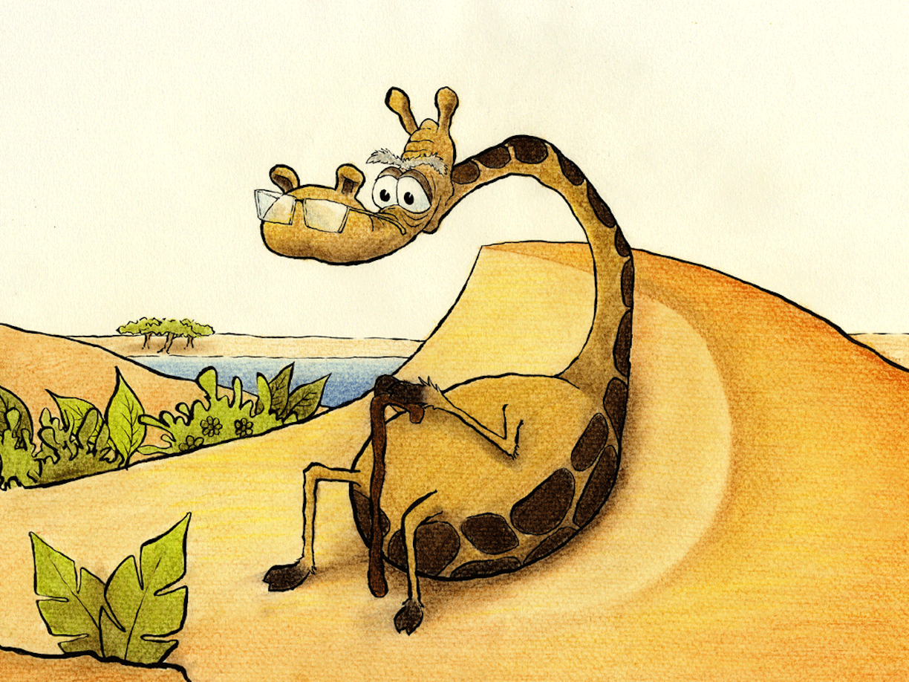

Bestefar lyttet nysgjerrig med alvor

Mens Samuel fortalte om tilfellet Halvor

Her ute er blomster en sjeldenhet

Dog finnes det én, såvidt jeg vet

På Måneåsens topp er en skjønn orkidé

Og like ved den står Visdommens Tre

Plukk ikke blomsten, la den få stå

Men lytt til dens budskap og du vil forstå

Jeg har laget no’ godt som reisenister

Kanskje honning på brød og rabarbra frister?

Så bega våre venner seg ut på en reise

Og langt i det fjerne så de Måneåsen kneise